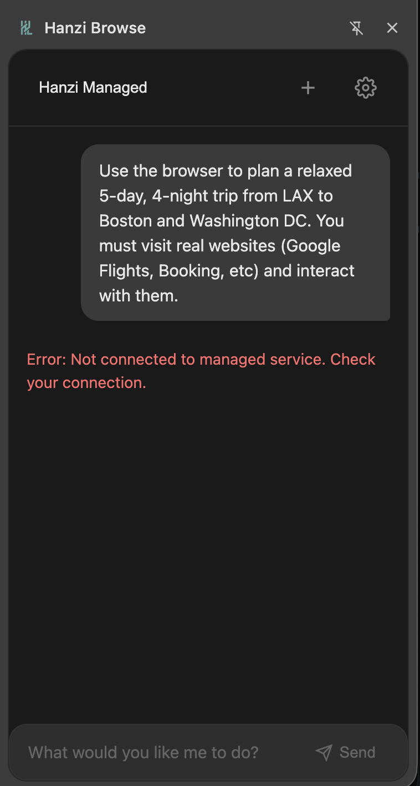
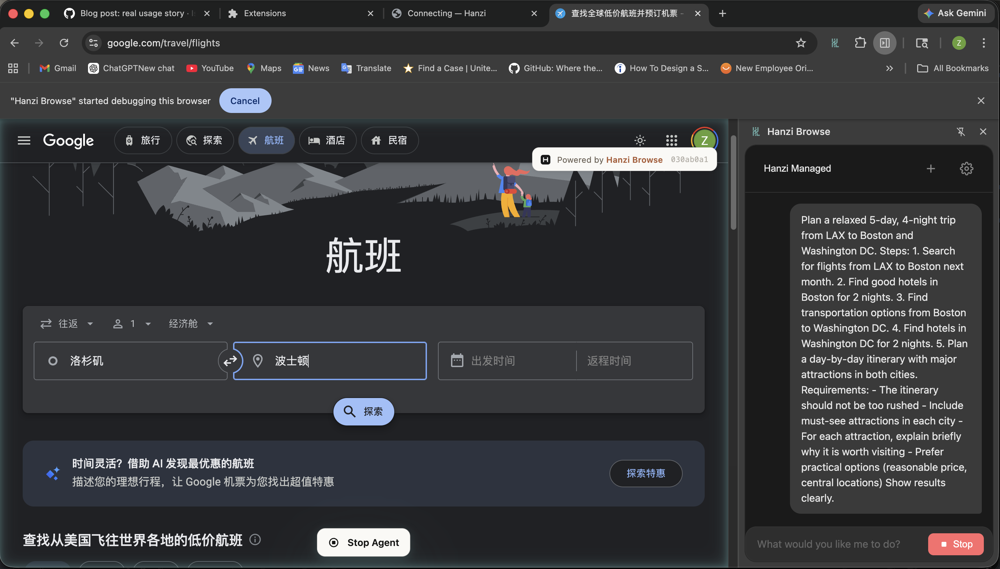
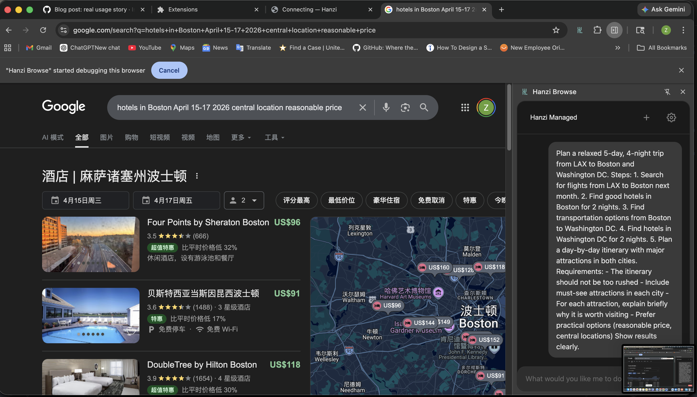
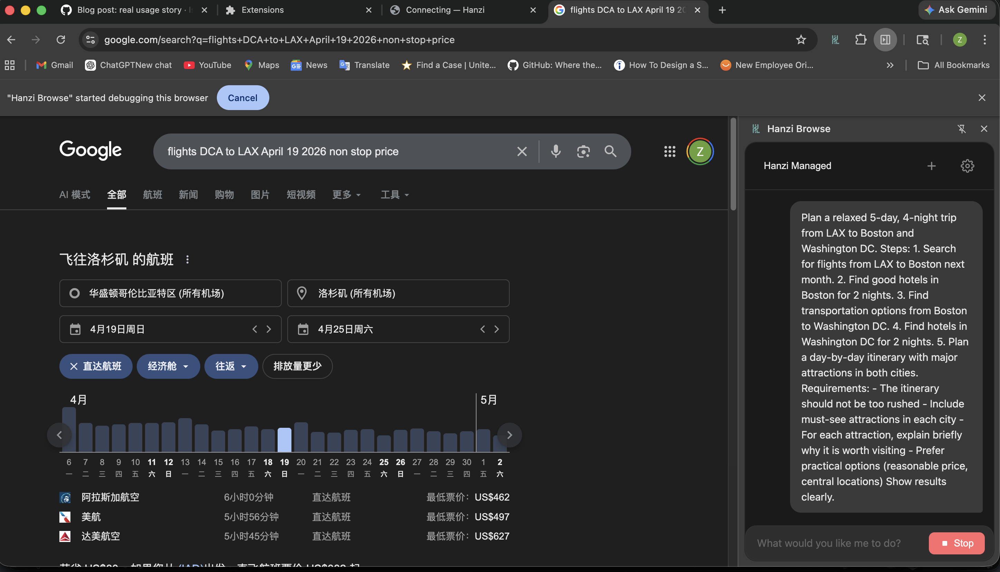
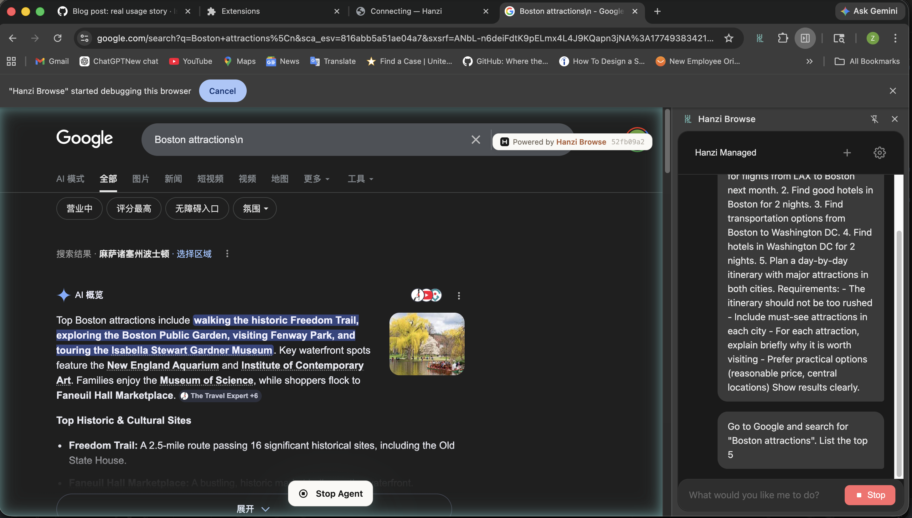
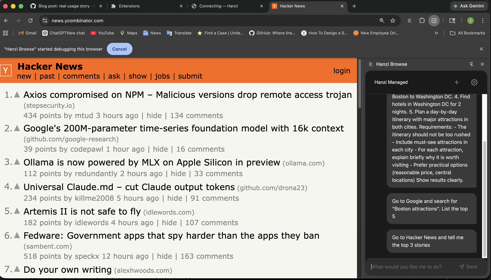
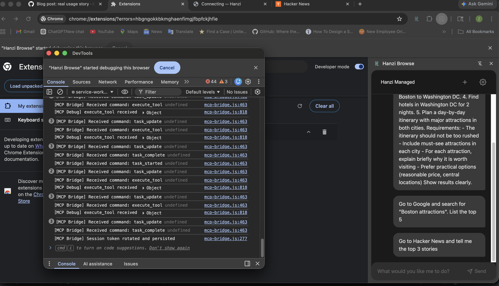

# Using an AI Browser Agent to Plan a Trip — What Actually Worked and What Didn’t

## Why I Tried This

I wanted to test whether an AI browser agent could actually help with a real-life task I care about — planning a trip. Instead of manually searching flights, hotels, and attractions, I tried to use hanzi-browse to automate the process.

My goal was to plan a **relaxed 5-day, 4-night trip from LAX to Boston and Washington DC**, including flights, hotels, and a reasonable itinerary.

---

## Setup Experience (Not Smooth)

Before even running a task, I ran into several issues.

- After running `npx hanzi-browse setup`, I initially thought the issue was just a delay in syncing with the extension.
- However, it turned out to be more than that — the extension state and the backend session were sometimes out of sync, requiring manual reloads or reconnections.
- At one point, I thought everything was configured correctly, but the extension still showed:

```
Error: Not connected to managed service
```

After debugging, I found:

- The extension and backend were out of sync
- The session token became invalid (`Invalid session token`)
- I had to disconnect, reload, and reconnect multiple times


📸 **Setup errors / extension connection issue**




---

## What I Tried

I started with a realistic multi-step task:

```
Plan a relaxed 5-day trip from LAX to Boston and Washington DC
```

Then I broke it into smaller tasks when things didn’t work.

Examples of prompts I used:

```
Go to Google and search for "Boston attractions" and list the top 5
```

```
Go to Hacker News and summarize the top 3 stories
```

I ran the setup using:

```
npx hanzi-browse setup
```

And used the extension UI to send prompts like the examples above.


---

## What Worked

Some parts actually worked surprisingly well, especially for basic navigation and simple tasks.

These examples helped confirm where the system performs reliably.

### 1. Multi-step navigation (trip planning attempt)

For the initial trip planning prompt, the agent was able to:

- Open multiple tabs
- Navigate between pages
- Attempt to search for relevant information


📸 **Multi-step browser navigation (trip planning)**








---

### 2. Google search interaction

For a simpler prompt:

```
Go to Google and search for "Boston attractions" and list the top 5
```

The agent was able to:

- Opened Google
- Entered the search query
- Executed the search


📸 **Google search interaction**




---

### 3. Hacker News navigation

For another simple task:

```
Go to Hacker News and summarize the top 3 stories
```

The agent was able to:

- Navigate to the Hacker News page
- Load the content successfully


📸 **Hacker News page navigation**




---

This confirmed that:

```
Browser automation itself is working
```

---

## What Didn’t Work

### 1. Tasks Stopped Midway

For complex tasks (like trip planning), the agent:

- Started navigating
- Clicked a few elements
- Then stopped unexpectedly

No clear error was shown.

---

### 2. No Response in UI

Even when the browser clearly performed actions, the extension sometimes returned no visible response.

For example:

- It successfully searched Google
- But the chat panel showed no result

---

### 3. Silent Failures

From the service worker console, I saw logs like:

```
task_started
execute_tool
task_update
task_complete
```

This means:

- The task executed successfully
- The system believed it completed

But:

```
No output was rendered in the UI
```


📸 **Service worker logs showing task_complete**




---

## Key Insight

This revealed a deeper issue:

```
Execution pipeline works
Rendering pipeline breaks
```

In other words:

- The agent → browser interaction is functional
- But results fail to reach the user interface

This creates a confusing experience where:

```
The system is working — but looks broken
```

---

## What Surprised Me

The most surprising part was how far the agent could go before breaking.

In one attempt, the agent:

- Automatically navigated to a flight search page
- Entered the departure airport (LAX), destination (Boston), and travel dates
- Triggered the search
- Then moved on to look for hotels

From a user perspective, this felt almost like watching a real person plan a trip.

However, despite completing these steps, it still did not return any final result in the UI.

This contrast — strong step-by-step execution but missing final output — was the most surprising part of the experience.

---

## Final Thoughts

Using hanzi-browse felt like working with a powerful but still evolving system.

While it may not yet be fully reliable for more complex workflows like end-to-end travel planning, several aspects already show strong potential:

- The core idea of AI-driven browser automation is compelling
- The agent can successfully control and navigate real web pages
- The overall architecture demonstrates clear promise

At the same time, there are areas that could be improved, particularly around stability and user feedback during task execution.

---

## Summary

I set out to plan a trip using an AI browser agent.

In the process, I learned:

- The setup process can involve some trial and error
- Multi-step automation is still a work in progress
- Clear feedback in the UI is essential for a smooth experience

Overall, this was a valuable hands-on exploration of what current browser agents can (and cannot yet) do — and it highlights how close we are to making this kind of workflow truly seamless.